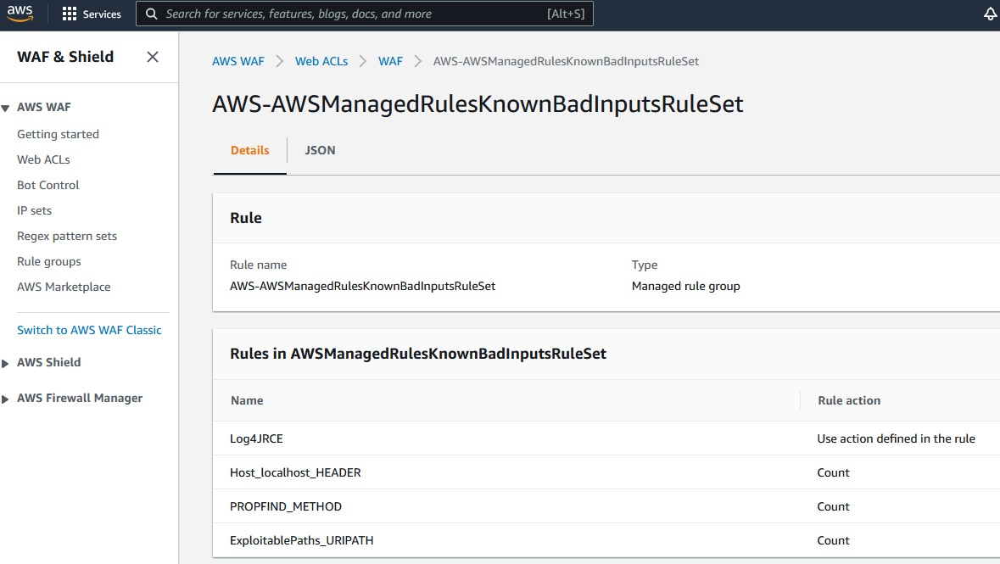

# aws-log4j-mitigations

Mitigations to implement on AWS to attempt to prevent log4j exploitation.

## AWS WAF

This is likely the best option to implement as Amazon will be able to keep the rule up-to-date.

Enable `AWS-AWSManagedRulesKnownBadInputsRuleSet` where `Log4JRCE` is available in the latest version.

You can find example Terraform to create the rule with just `Log4RCE` enabled here: [aws_waf/rule.tf](aws_waf/rule.tf)

### Console:

## CloudFront

If you'd like more control over filtering, suggest using Lambda@Edge and in particular origin requests with body enabled.

The [faas_code/index.js](faas_code/index.js) attempts to capture bad inputs, it can also find base64 and test it (which systems may parse headers automatically before passing to log4j where it could be exploited).

The main _engine_ of the code is using the following regex: `/(?:\$|\%24)(?:\{|\%7b)[^\w]*?j[^\w]*?n[^\w]*?d[^\w]*?i[^\w]*?(?:\:|\%3a)/im;`

### Lambda@Edge

See [cloudfront/lambda@edge/](cloudfront/lambda%40edge/) for example Terraform of implementing the [faas_code/index.js] as a Lambda@Edge origin request.

### CloudFront Functions

See [cloudfront/functions/](cloudfront/functions/) for example Terraform of implementing the [faas_code/index.js] as a CloudFront Function viewer request.

_Note:_ CloudFront Functions don't have an option to inspect the body (for example, where parameters from POST requests would end up).
